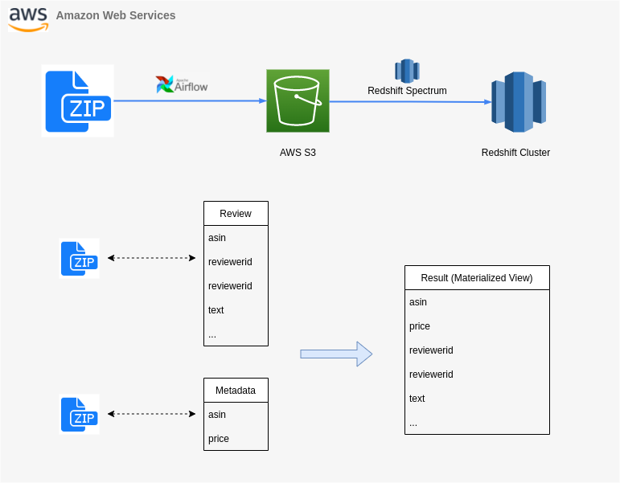
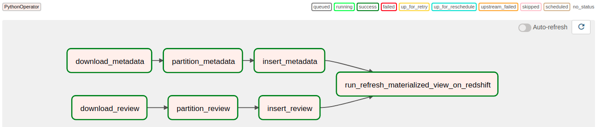
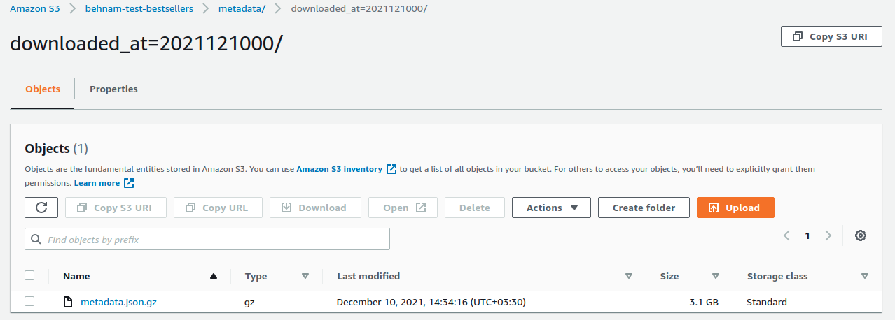

# Technical Assignment
A pipeline for extracting data from [JSON files](http://jmcauley.ucsd.edu/data/amazon/links.html), transforming it into a dimensional model and imporitng it into a Redshift cluster.


## Requirements
- Terraform
- AWS Account
- Python 3
- smart_open
  
## Setup (Airflow on Docker in EC2 + GitLab's CI/CD)
Airflow will be installed inside Docker container, which will be deployed in Amazon's EC2. For continuous integration and continuous deployment (CI/CD), GitLab is being used.
- **EC2**
  1. Use the files inside Terraform directory to Set up EC2 server with installed Docker and docker-compose.
- **Airflow**
  1. Create new repository on GitLab, and push Aiflow directory of this repository there.
  2. On your GitLab's project page, open Settings > CI/CD > Repository Variables. Configure several variables:<br>
       * _AIRFLOW_WWW_USER_PASSWORD -> Arbitrary password for Airflow (Variable)<br>
       * _AIRFLOW_WWW_USER_USERNAME -> Arbitrary username for Airflow (Variable)<br>
       * EC2_ADDRESS -> IP address of your EC2 host (Variable)<br>
       * GITLAB_PASSWORD -> GitLab password (Variable)<br>
       * GITLAB_USERNAME -> GitLab username (Variable)<br>
       * SSH_KEY_EC2 -> Your SSH key (with .pem suffix) (File)<br>
  3. Configure GitLab's runner for CI/CD
  4. Open gitlab-ci.yml, change line 25 and 26 with your email (that registered on GitLab) and Name.
  5. Run CI/CD pipeline.
  6. Open the Airflow UI in browser on EC2_IP_ADDRESS:8080
- **Redshift**
  1. Run content of `sql/bestsellers.sql` on your Redshift cluster. It'll create two schema (internal, external) and two tables (reviews, medadata) inside each of them.
## Description
### Airflow Dag
This pipeline has a single Dag that has 7 tasks inside itself. 

Here is a description for each kind of tasks:
- `download_*` 

    These tasks are responsible for downloading the `zip` files into the `AWS S3`. For this purpose, [smart_open](https://github.com/RaRe-Technologies/smart_open) (utils for streaming large files in Python) is being used. It supports transparent, on-the-fly (de-)compression for a variety of different formats. smart_open in it's core uses `multipart upload` feature of AWS S3. 
    > Using multipart upload provides the following advantages: 
    > - Improved throughput - You can upload parts in parallel to improve throughput.
    > - Quick recovery from any network issues - Smaller part size minimizes the impact of restarting a failed upload due to a network error.
    > - Pause and resume object uploads - You can upload object parts over time. After you initiate a multipart upload, there is no expiry; you must explicitly complete or stop the multipart upload.
    > - Begin an upload before you know the final object size - You can upload an object as you are creating it.
    > <br> [Refrence](https://docs.aws.amazon.com/AmazonS3/latest/userguide/mpuoverview.html)
     
    

- `partition_*` 

  These tasks create new partition (if not exists) for External Redshift Spectrum tables based on the newly downloaded zip file. They are using `downloaded_at=<year+month+day+hour>` as partition key convention in Apache Hive partitioning fashion, so, it could be used in AWS Athena queries too.   

- `insert_*` 
  
  These tasks insert data from external tables to the corresponding internal table inside Redshift cluster. They drop duplicated rows based on the specified columns for each table (please look at ``distinct_on_columns`` field on the `Aiflow/dags/yaml/bestsellers_data_sources.yml`).

- `run_refresh_materialized_view_on_redshift` 
  
  This is a simple task that runs a query on Redshift cluster to update the already created materialized view (join between review & metadata).
  Sample row of the result:
```
Name          |Value                                                                  |
--------------+-----------------------------------------------------------------------+
reviewerid    |A00052762R5Y4PZEA6ETJ                                                  |
asin          |B00005Q2ZI                                                             |
reviewername  |Christopher Willis                                                     |
reviewtext    |Great insight into the making of this album - great stuff from the band|
overall       |5.0                                                                    |
summary       |Five Stars                                                             |
unixreviewtime|1404518400                                                             |
reviewtime    |07 5, 2014                                                             |
price         |2.79                                                                   |
```

    

    

